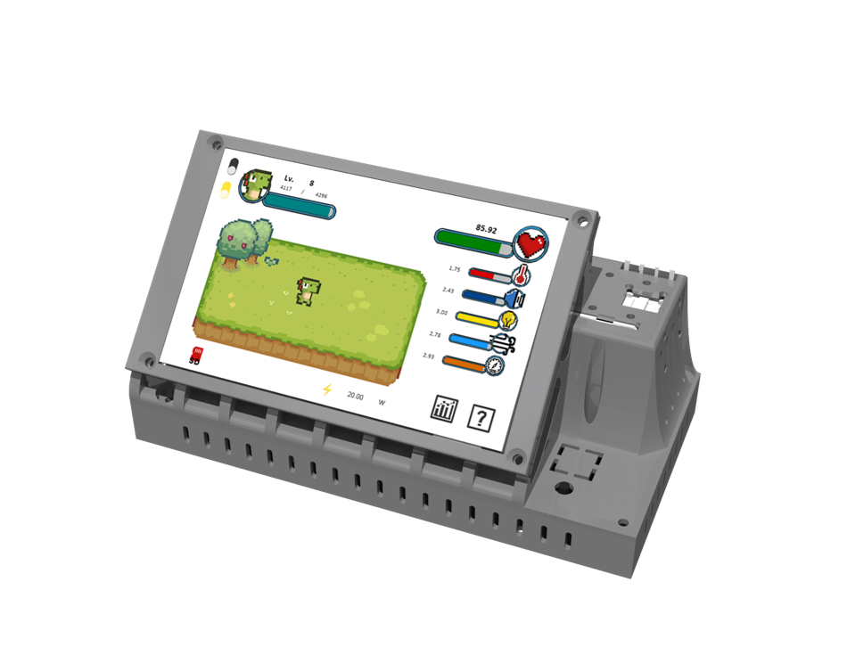
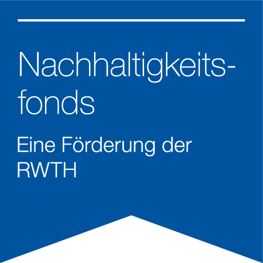

# Ressourcenwächter

*Resource Guardian - An open-source, modular Indoor Environmental Quality (IEQ) monitoring system featuring a gamified Graphical User Interface (GUI)*

**Resource Guardian's Wiki: [Link](https://rw.e3d.rwth-aachen.de/)**

## Overview

<!-- TOC -->
* [Ressourcenwächter](#ressourcenwächter)
  * [Overview](#overview)
  * [Key Features](#key-features)
  * [DIY Guide](#diy-guide)
  * [License](#license)
    * [Software & Firmware](#software--firmware)
    * [Hardware](#hardware)
    * [Feedback System (Texts & Concepts)](#feedback-system-texts--concepts)
    * [Documentation](#documentation)
    * [Artworks](#artworks)
  * [Acknowledgements](#acknowledgements)
  * [Contributors](#contributors)
<!-- TOC -->

## Key Features

- **Modular IEQ monitoring system**

  Open-source system for monitoring key IEQ parameters, designed for real-world field studies and long-term deployment.

- **Multi-sensor data acquisition**

  Support for air temperature, humidity, illuminance, sound level, CO2 concentration, VOC, wind speed, window status, electric power, and other IEQ sensors, with synchronized data collection and time-stamping.

- **Autonomous system**

  On-device GUI providing real-time visualization, intuitive interaction, and immediate feedback without requiring an external computer or internet connection. All data are stored locally on a microSD card.

- **Behavior-oriented feedback system**

  Context-aware feedback and recommendations aiming to support more resource-/energy-efficient and healthy user behavior, based on measured IEQ conditions.

## DIY Guide

- Step 1: [Prepare enclosure](https://rw.e3d.rwth-aachen.de/en/wiki/prepare-enclosure/)
- Step 2: [Prepare PCB](https://rw.e3d.rwth-aachen.de/en/wiki/prepare-pcb/)
- Step 3: [Assembling Ressourcenwächter](https://rw.e3d.rwth-aachen.de/en/wiki/assembling-ressourcenwaechter/)

## License

The *Ressourcenwächter (Resource Guardian)* project is a mixed open-source project consisting of software, firmware, hardware designs, documentation, feedback content, and third-party artwork. Different components of the project are released under different licenses, as outlined below.

In general, this project may be used, modified, and redistributed, provided that appropriate attribution is given and the respective license terms of each component are respected. **Non-commercial** use is permitted for all components, while commercial use is restricted for parts of the project licensed under non-commercial Creative Commons licenses. Third-party assets remain subject to their original licenses.

Please read this section carefully before reusing or redistributing any part of the project.

### Software & Firmware

The codebase is structured into following main components:

1. **Firmware:** Code running on embedded microcontrollers.

2. **Software for touch display GUI:** Graphical user interface running directly on the monitoring device.

<!-- 3. **Desktop software:** Desktop applications running on computers. -->

Author: Qirui Huang

License: GNU General Public License v3.0 (GPL-3.0)

Unless stated otherwise, all software and firmware developed within this project are licensed under GPL-3.0. Any derivative work must be distributed under the same license.

### Hardware

Author: Qirui Huang

License: Creative Commons Attribution-NonCommercial-ShareAlike
4.0 International (CC BY-NC-SA 4.0)

This license applies to all hardware-related materials, including but not limited to schematics, PCB layouts, enclosure designs, and mechanical drawings.

Commercial use is not permitted. Adaptations must be shared under the same
license.

### Feedback System (Texts & Concepts)

Authors: Qirui Huang, Marc Syndicus, Anna Langenbeck, Anna Deriks, Sonja Herzogenrath

License: CC BY-NC-SA 4.0

This license applies to feedback texts, categorization schemes, behavioral
recommendation concepts, and related content, except for quotations and otherwise indicated parts.

### Documentation

Authors: Qirui Huang, Marc Syndicus

License: CC BY-NC-SA 4.0

This includes assembly guides, methodological documentation, and other written materials, except for quotations and otherwise indicated parts.

### Artworks

This project incorporates third-party assets. These assets are not covered by the software license and remain subject to their respective licenses:

- [Dino Characters](https://arks.itch.io/dino-characters) by @[ArksDigital](https://x.com/ArksDigital), license: free
- [Dino Family](https://demching.itch.io/dino-family) by @[DemChing](https://demching.itch.io/), license: CC-BY 4.0
- [Sprout Lands Asset Pack](https://cupnooble.itch.io/sprout-lands-asset-pack) by @[Cup Nooble](https://cupnooble.itch.io/), license: free for non-commercial projects
- [Hearts](https://fliflifly.itch.io/hearts-and-health-bar) by @[fliflifly](https://fliflifly.itch.io/), license: CC-0

All artworks not listed above are created by Qirui Huang and licensed under
CC BY-NC-SA 4.0.

[Back to top ↥](#overview)

## Acknowledgements

The project Ressourcenwächter was funded by RWTH Aachen University's Sustainability Fund (Ref. 02-2023-004). We are grateful for the support.

[Back to top ↥](#overview)

## Contributors

[Back to top ↥](#overview)
