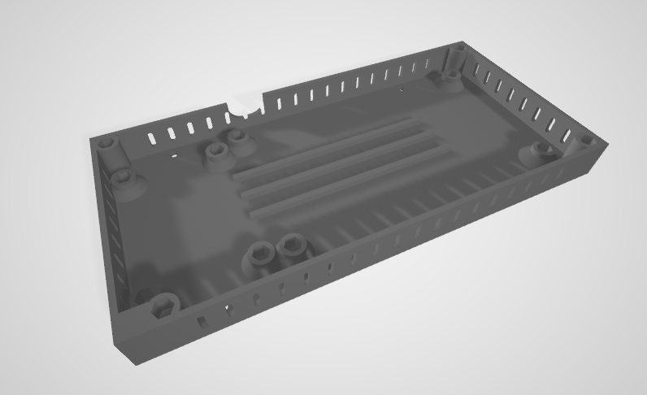
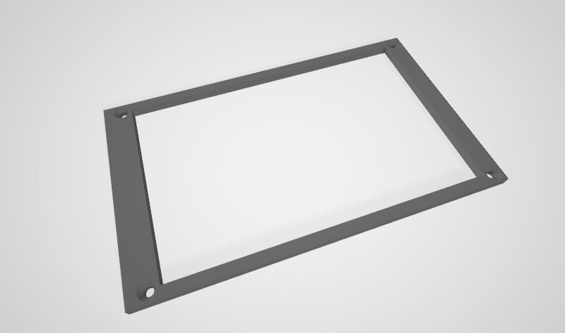
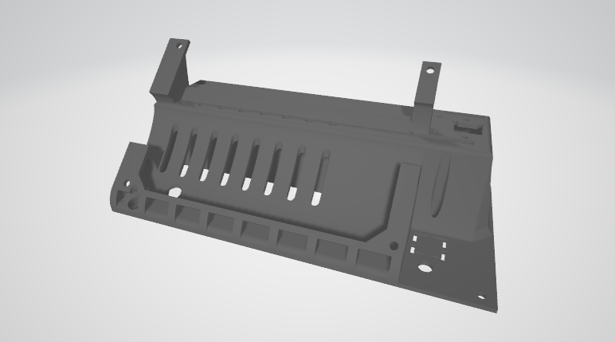

# Hardware Design

## Enclosure

STL and STEP format files for the enclosure can be found in this folder, consisting of 3 parts:

1. `enclosure_base`

2. `enclosure_display_case`

3. `enclosure_top`

### 3D printing files

Files for 3D printing can be found in the `3dprint` folder.

We used the [Orca Slicer](https://github.com/OrcaSlicer/OrcaSlicer) to slice the STL file. You can find the project files (`.3mf`) and the final `.gcode` file in the folder above for *Creality Ender 3 v2* and *Ender 5 plus*. If you're using the same 3D printer, you may use the `.gcode` file directly.

The following are the slicing parameters we used:

*Creality Ender 3 v2*:

*Creality Ender 5 plus*:

