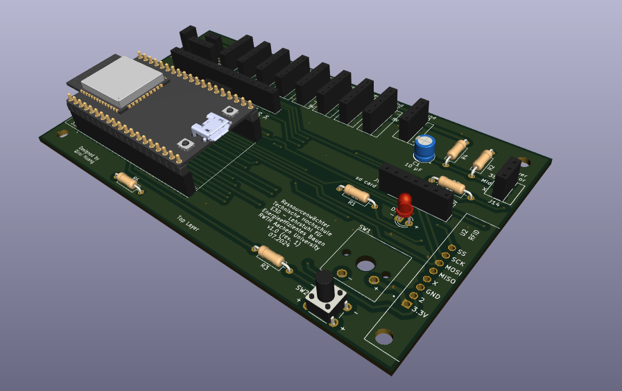
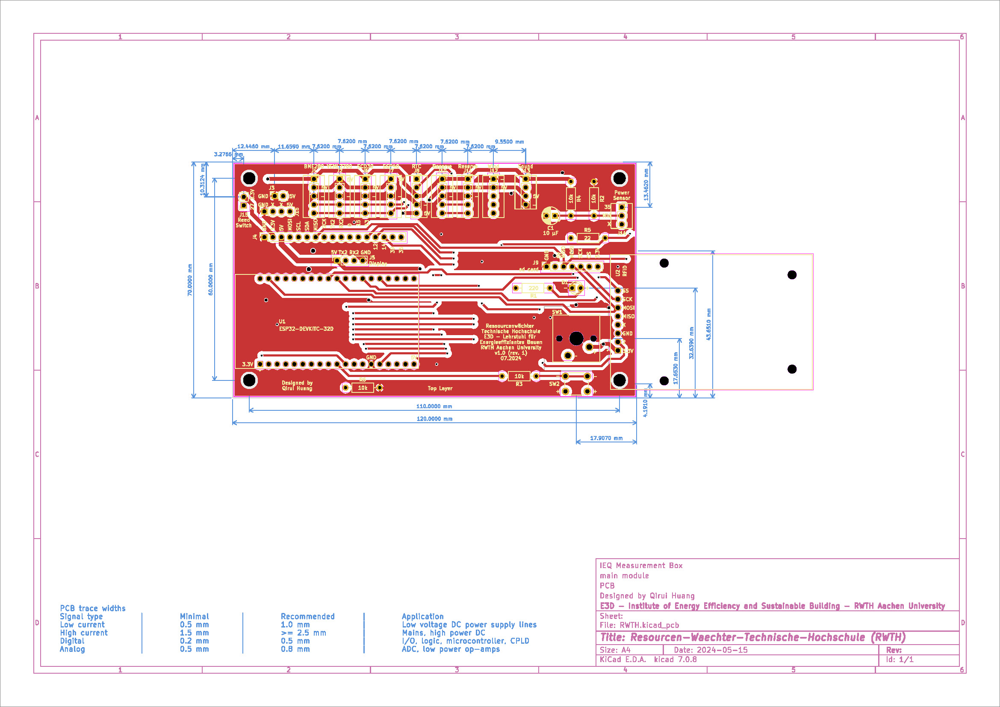
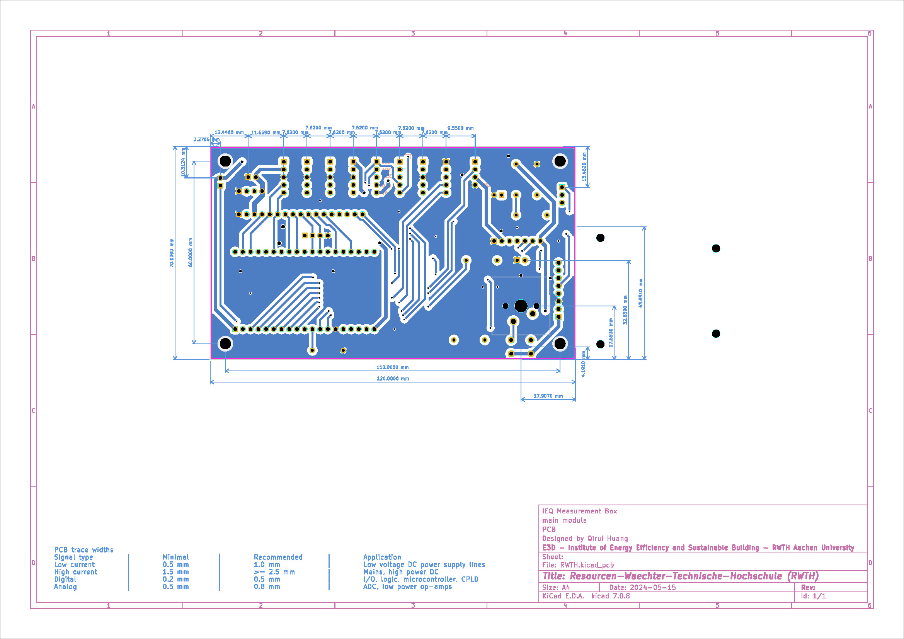

# Hardware Design

[DIY Guide: Prepare PCB](https://rw.e3d.rwth-aachen.de/en/wiki/prepare-pcb/)

## PCB

The relevant PCB documents can be found in this folder.

 

We used [KiCAD](https://www.kicad.org/) for the design. To make DIY as easy as possible, we selected THT components instead of SMD.

Because there are no complex circuits and to reduce costs, we have chosen simple double-layer PCB, and the schematics for the top and bottom layers are shown below:

 

 

### Production files

You can give the latest version of the `.zip` file in the [production file folder](./output) (`./output`) to the PCB manufacturer for production.
