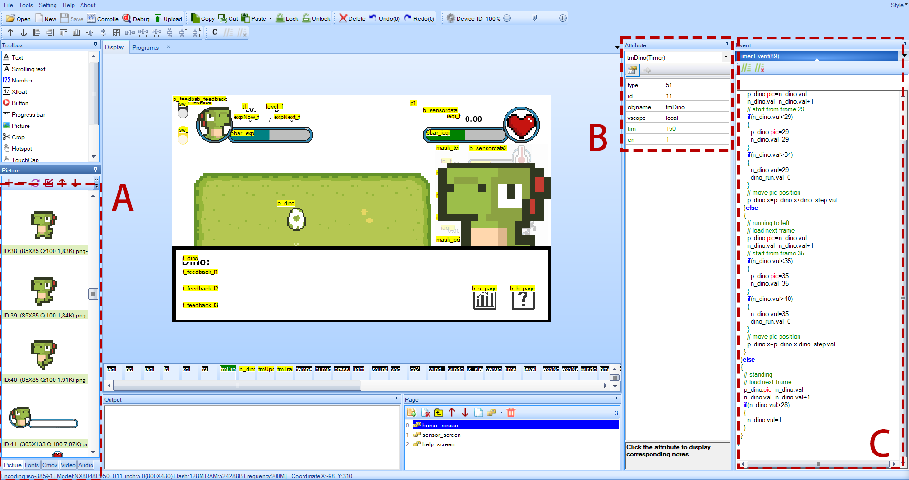

# GUI

GUI files are provided for the following two touch displays:

1. Nextion Intelligent HMI Display 5" [NX8048P050-011R](https://nextion.tech/datasheets/nx8048p050-011r/) (Resistive) or [NX8048P050-011C](https://nextion.tech/datasheets/nx8048p050-011c/) (Capacitive)
2. Taojingchi [TJC8048X550_011R](http://wiki.tjc1688.com/product/new_datasheet/X5/TJC8048X550_011R.html) (Resistive) or [TJC8048X550_011C](http://wiki.tjc1688.com/product/new_datasheet/X5/TJC8048X550_011C.html) (Capacitive)

Both resistive and capacitive versions are supported, with no differences beyond the hardware itself. TJC is only available in certain regions but typically costs less.

The GUI for Nextion touch display is developed using [Nextion Editor](https://nextion.tech/editor_guide/). The GUI for TJC touch display is developed using the [USART HMI](http://wiki.tjc1688.com/download/usart_hmi.html) provided by TJC. The user interfaces are largely identical, though USART HMI only supports Chinese language.

If you wish to install both Nextion Editor and USART HMI for development, please refer to the instructions in [`TJC_USART_HMI/README.txt`](./TJC_USART_HMI/README.txt).

> For code syntax in Nextion Editor, refer to: [The Nextion Instruction Set](https://nextion.tech/instruction-set/)

> For code syntax in USART HMI, refer to [USART HMI Grammar](http://wiki.tjc1688.com/grammar/index.html) (should be the same as in Nextion Editor)

## How to change GUI?

The following steps use Nextion Editor as an example. The process is identical for USART HMI:

1. Open the corresponding language version of the `.hmi` project file in Nextion Editor, e.g., `Nextion_HMI/GUI_EN/gui_nextion_en.hmi` for english version
2. To replace Dino's animations (e.g., using custom characters or skins), replace the images with ID **1 - 40** and **85 - 104** in the left image library (area **A** in the figure below). These represent each frame of Dino's character animation (85 x 85 pixels):

   1. **1 - 28**: Animation frames for standing
   2. **29 - 40**: Animation frames for left/right movement after click 
   3. **85 - 104**: Animation frames for Dino at Level 0

Corresponding code can be found in `tmDino(Timer)` (areas **B** and **C**).



To replace the island background, modify images with ID **59 - 84**, which correspond to backgrounds for levels 0 - 25 (800 x 480 pixels). The relevant code can be found in `tmIsland(Timer)`.

To add more level-specific backgrounds, add new images to the picture library (maintaining 800 x 480 pixels) and modify the logic in `tmIsland(Timer)`.

Example:

```
...
}else if(level.val==24)
{
  p_island.pic=83
}else if(level.val==NEW_LEVEL)
{
  p_island.pic=NEW_BACKGROUND_PIC_ID
}else
{
  p_island.pic=84
}
```

## How to modify/translate the feedback content?

To modify or translate the feedback content, you may find all feedback messages and the relevant code in `b_feedback(Button) - Touch Release Event`. Each feedback message consists of three lines of text, with no more than 50 characters per line.

Example:

```
t_feedback_l1.txt="The university participates in climate actions!"
t_feedback_l2.txt="I can help you to save energy thanks to "
t_feedback_l3.txt="RWTH's Sustainability Fund"
```